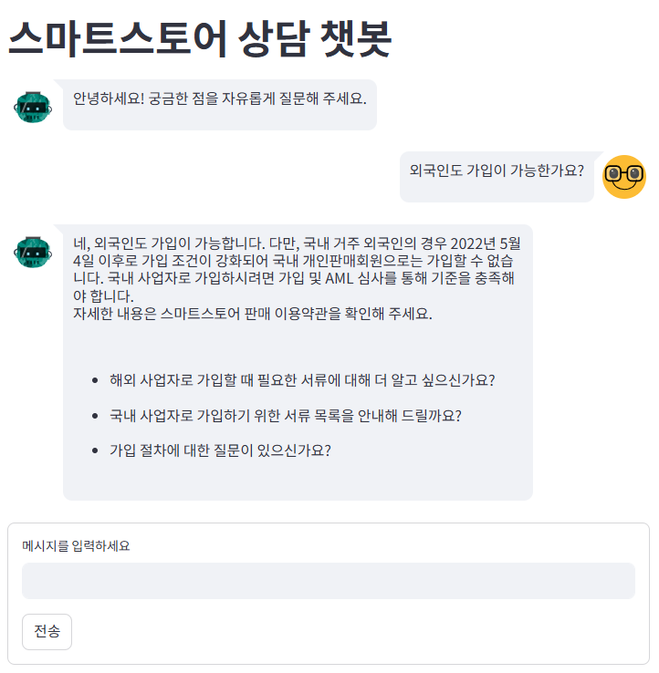
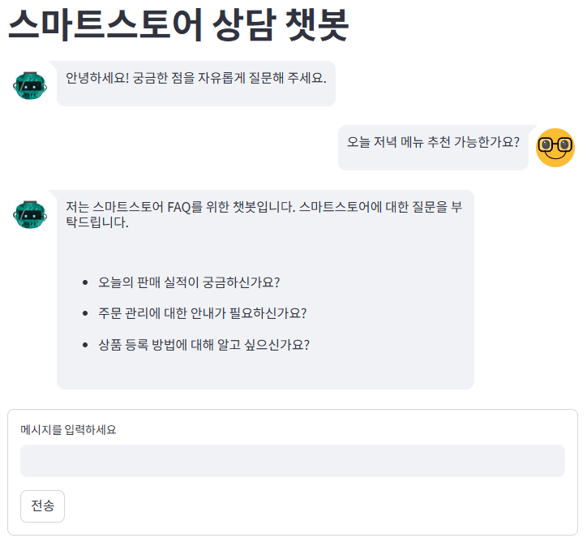

# FAQ ChatBot - 스마트스토어 상담 AI

OpenAI의 GPT 모델과 ChromaDB를 기반으로 구현한 스마트스토어 특화 FAQ 챗봇입니다.  
Streamlit UI와 FastAPI 백엔드를 통해 질문을 받고, FAQ 벡터 검색 후 정확하고 자연스러운 답변을 제공합니다.

---

## 1. 프로젝트 구조

```
C:.
│ .env 
│ app.py 
│ chatbot.py
│ main.py
│ requirements.txt 
│
├─data
│ │ faq.csv 
│ │ final_result.pkl
│ │
│ ├─chroma # ChromaDB 벡터 DB 저장 경로
│ │
│ └─make_db
│ │ make_csv.py 
└─└─vectorDB.py
```


---

## 2. 문제 접근 방법

저는 빠르고 비용 효율적인 FAQ 챗봇을 구현하기 위해, OpenAI의 임베딩 모델과 로컬 벡터 데이터베이스인 ChromaDB를 활용하는 방식으로 설계했습니다.

- 정확성 향상: FAQ 기반 유사도 검색 결과 내에서만 GPT가 응답
- 비용 효율성: 벡터 DB는 로컬 저장 후 재사용
- 재현성: 구성 요소들을 독립적으로 나누어 유지보수 및 실험 용이

---

## 3. 프롬프트 전략

챗봇의 응답 품질을 높이기 위해 다음 전략을 적용한 프롬프트를 구성했습니다:

- FAQ 기반의 공손하고 정확한 응답 유도
- 도메인 외 질문 차단 및 관련 질문 유도
- 자연스러운 대화 흐름 유지를 위한 후속 질문 제안

```python
prompt = f"""
당신은 스마트스토어 전문 상담 AI입니다. 아래 예시처럼 FAQ를 기반으로 사용자 질문에 공손하고 정확하게 답변하세요.  
- FAQ 내용 외의 질문에는 스마트스토어 관련 질문을 유도해주세요.  
- 답변 후에는 관련된 짧은 후속 질문 2~3개를 제안해 대화를 자연스럽게 이어가세요.
- 후속 질문은 줄을 바꿔서 각각 `-` 기호로 시작하세요.

예시 1:
유저: 미성년자도 판매 회원 등록이 가능한가요?
챗봇: 네이버 스마트스토어는 만 14세 미만의 개인(개인 사업자 포함) 또는 법인사업자는 입점이 불가함을 양해 부탁 드립니다.
        - 등록에 필요한 서류 안내해드릴까요?
        - 등록 절차는 얼마나 오래 걸리는지 안내가 필요하신가요?

예시 2:
유저: 오늘 저녁에 여의도 가려는데 맛집 추천 좀 해줄래?
챗봇: 저는 스마트스토어 FAQ를 위한 챗봇입니다. 스마트스토어에 대한 질문을 부탁드립니다.
        - 음식도 스토어 등록이 가능한지 궁금하신가요?

FAQ:
{context}

유저: {user_question}
챗봇:
"""
```
---

## 4. 주요 파일 설명

| 파일명                | 설명                                      |
|----------------------|-------------------------------------------|
| `.env`               | OpenAI API 키 환경 변수 파일              |
| `requirements.txt`   | 의존 패키지 목록                          |
| `app.py`             | Streamlit 기반 UI                         |
| `main.py`            | FastAPI 백엔드 서버                       |
| `chatbot.py`         | 질문 임베딩 + 검색 + 응답 생성 로직       |
| `data/final_result.pkl` | 원본 FAQ 데이터                         |
| `data/faq.csv`       | 전처리된 FAQ 텍스트 데이터                |
| `make_csv.py`        | pickle → CSV 변환 스크립트                |
| `vectorDB.py`        | FAQ 임베딩 → ChromaDB 저장 스크립트      |

## 5. 데모 예시 

챗봇이 실제로 동작하는 모습을 아래 이미지로 확인할 수 있습니다.

### 1. 스마트 스토어 관련 질문 예시




---

### 2. 스마트 스토어와 관련 없는 질문 예시




---
## 6. 코드 실행 방법(conda환경)

---

### 6.1 프로젝트 다운로드 및 환경 설정

```bash
# 저장소 클론
git clone https://github.com/Jacod97/FAQ_ChatBot.git
cd FAQ_ChatBot

# Conda 가상환경 생성 및 활성화
conda create -n faq-chatbot python=3.11 -y
conda activate faq-chatbot

# 패키지 설치
pip install -r requirements.txt

# OpenAI API 키 등록
echo OPENAI_API_KEY=your-api-key > .env
```

### 6.2 데이터 전처리 및 벡터 DB 생성
```bash
# FAQ CSV 생성
python data/make_db/make_csv.py

# 질문 임베딩 후 ChromaDB에 저장
python data/make_db/vectorDB.py
```

### 6.3 백엔드 서버 실행(FastAPI)
```bash
uvicorn main:app --reload
```

### 6.4 프론트엔드 실행(Streamlit)
```bash
streamlit run app.py
```
